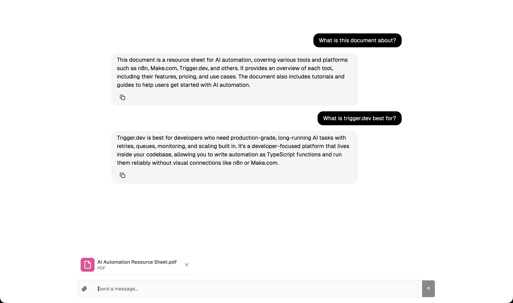

# 📄 Local PDF RAG Chatbot

**Chat with your PDFs — an AI chatbot that answers questions about any document you upload, running 100% locally and free with no API keys, using Ollama, LangGraph, and Next.js.**



---

## What it does

Upload one or more PDFs, then ask questions in plain English. The app finds the most
relevant passages from your documents and uses a **local large language model** to answer
— grounded in the actual content of your files, not the model's imagination. Everything
(the language model, the embeddings, and the vector search) runs **on your own machine**,
so it's private and costs nothing to run.

This is a **Retrieval-Augmented Generation (RAG)** system:

```
Upload:   PDF → split into chunks → embed each chunk → store vectors
Ask:      question → embed → find the most similar chunks → LLM writes a grounded answer
```

## Built with

- **Next.js** (React, TypeScript) — chat UI with file upload and streaming responses
- **LangChain** + **LangGraph** — orchestration of the ingestion and retrieval pipelines
- **Ollama** — runs the LLM (`llama3.2`) and embedding model (`nomic-embed-text`) locally
- **In-memory vector store** — semantic search over document chunks
- **TypeScript**, **Yarn workspaces (monorepo)**, **Turborepo**

## Architecture

```
┌─────────────────────┐        ┌──────────────────────────┐        ┌───────────────────┐
│  Frontend (Next.js) │  ⇄     │  Backend (LangGraph)     │   ⇄    │  Ollama (local)   │
│  UI · upload · chat │        │  ingestion + retrieval   │        │  llama3.2         │
│  localhost:3000     │        │  graphs · localhost:2024 │        │  nomic-embed-text │
└─────────────────────┘        └──────────────────────────┘        └───────────────────┘
```

---

## 🔧 What I changed vs. the original template

This project began as the open-source
[`ai-pdf-chatbot-langchain`](https://github.com/mayooear/ai-pdf-chatbot-langchain) template
(the companion project to the O'Reilly book *Learning LangChain*), which was built around
**paid cloud services** (OpenAI for the models, Supabase for the vector database). I
re-engineered it to run **fully offline and free**, and fixed several real issues along the
way:

- **Replaced OpenAI with local Ollama models** — swapped `OpenAIEmbeddings` and the
  OpenAI chat model for Ollama's `nomic-embed-text` and `llama3.2`, so no API keys or
  paid usage are required.
- **Replaced the Supabase vector database with a local in-memory vector store** — removing
  the external database dependency entirely while keeping the same retriever interface.
- **Fixed a structured-output crash with local models** — the query-router used
  `withStructuredOutput()`, which on the Ollama integration requested a *tool call* but
  parsed the message's *text* (empty for tool calls), throwing `Failed to parse. Text: ""`.
  Switched it to the `functionCalling` method, which reads the tool call correctly.
- **Fixed cross-document answer leakage** — the in-memory store accumulated every uploaded
  PDF, so answers could come from an old document. Now each upload clears the store first,
  giving a clean context per document.
- **Fixed hallucinations on large PDFs** — added recursive text **chunking** during
  ingestion, raised Ollama's context window from its 2048-token default (`num_ctx: 8192`)
  so retrieved text isn't truncated, and increased retrieval recall (`k: 8`).
- **Resolved dependency conflicts** across the Yarn monorepo (`zod` and `tailwindcss`
  version mismatches) that broke the build and the CSS pipeline.

See [`RUNNING_LOCALLY.md`](RUNNING_LOCALLY.md) for the full list of files touched.

---

## 🚀 Run it locally

**Prerequisites:** [Node.js](https://nodejs.org), [Yarn](https://yarnpkg.com), and
[Ollama](https://ollama.com).

```bash
# 1. Pull the local models (one-time, ~2.3 GB)
ollama pull llama3.2
ollama pull nomic-embed-text

# 2. Install dependencies (from the repo root)
yarn install

# 3. Create the env files (no keys needed — defaults work)
cp backend/.env.example backend/.env
cp frontend/.env.example frontend/.env

# 4. Start the three services (each in its own terminal)
ollama serve                       # Ollama on :11434
cd backend && yarn langgraph:dev   # backend API on :2024
cd frontend && yarn dev            # app UI on :3000
```

Then open **http://localhost:3000**, click the 📎 icon to upload a PDF, and start asking
questions. Full details and notes are in [`RUNNING_LOCALLY.md`](RUNNING_LOCALLY.md).

> **Note:** the vector store is in-memory, so uploaded documents reset when the backend
> restarts, and each new upload replaces the previous one. Upload multiple PDFs together
> to query them as a set.

---

## Credits

Based on the open-source
[ai-pdf-chatbot-langchain](https://github.com/mayooear/ai-pdf-chatbot-langchain) template
by Mayo Oshin (MIT License), re-engineered to run fully locally. The original license is
retained in [`LICENSE`](LICENSE).
